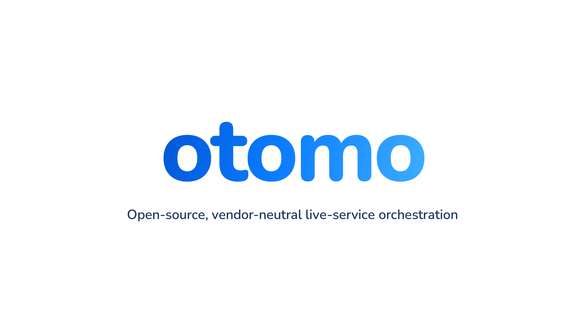

  

# Otomo documentation

**Otomo** is a self-hosted, open-source backend for Godot live-service games. It's the
part of an online game that players never see: the servers that deliver content updates,
remember who each player is, put friends into a party, and find a game server for their
match. Your game ships the fun; otomo runs everything around it, on a server you control.

This documentation is for teams who have never used otomo before and want to run it for
their own game. You'll host otomo on your own Linux VM, then connect your Godot project
to it with otomo's SDK.

!!! tip "You don't need to be a web or server programmer"
    These pages assume you know Godot and a little C#, and nothing else. Every time a
    page uses a networking, web or Linux term for the first time, it explains it. If a
    word is still unfamiliar, look it up in the [Glossary](reference/glossary.md).

## The path from zero to a running game

Most teams follow these pages in order:

1. **[What is otomo?](start/what-is-otomo.md)** Decide whether otomo fits your game.
2. **[Before you begin](start/before-you-begin.md)** Get a VM, a domain name, and your PC
   ready.
3. **[Deploy otomo on a VM](start/deploy-on-a-vm.md)** Install and start otomo, and give it
   a public HTTPS address. This takes an afternoon.
4. **[Install the SDK](guide/install-the-sdk.md)** Add otomo to your Godot project and
   check the game reaches your server.
5. **[Publish your first content update](guide/first-patch.md)** Change something in the
   admin website and watch the running game pick it up.
6. **[Run a new game server build](guide/game-servers.md)** and
   **[Join a match](guide/joining-a-match.md)** Put your game server behind otomo and get
   players into matches.

## Find something specific

| I want to… | Go to |
|---|---|
| Show a download bar while the game updates | [Build a download screen](guide/download-screen.md) |
| Use the admin website | [Use the admin website](guide/admin-website.md) |
| Look up a function, signal or setting | [SDK reference](reference/sdk.md) |
| Fix an error | [Troubleshooting](troubleshooting.md) and [Error codes](reference/errors.md) |
| Update otomo or back it up | [Deploy otomo on a VM › Keeping it running](start/deploy-on-a-vm.md#keeping-it-running) |

## How this documentation is organised

**Getting started**
: What otomo is, what you need, and how to deploy it on a VM.

**Concepts**
: Plain-language explanations of the ideas behind otomo: how a game talks to a server, what
  HTTP is, what a login token is, how content updates work, what a container is. Read
  these once. The guides link back to them whenever you need them.

**Guides**
: Step-by-step walkthroughs. Each one says what you need before you start, gives every
  command and click, and shows what you should see after each step.

**Reference**
: Short, exact descriptions for when you already know what you're looking for: every
  public function, signal and setting of the SDK, every error code, and a glossary.

## Contributing to otomo itself

These pages are about *using* otomo. If you want to change otomo's own code, start with
`CONTRIBUTING.md` and the design documents in the repository's `design/` folder.
