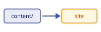

# Writing pages

A content directory is plain Markdown plus one configuration file. The framework
provides the theme, navigation, search, syntax highlighting and the strictness.

## `_site.yml`

`_site.yml` is the whole interface between a site and the framework. Only these
keys are allowed; anything else fails the build with the key named, so a typo
cannot silently do nothing:

```yaml
site_name: Example Wiki           # required, non-empty string
site_description: …               # optional
nav:                              # optional; defaults to the folder layout
  - Home: index.md
  - Getting started: guide/getting-started.md
copyright: …                      # optional
extra: {}                         # optional, passed through to the theme
theme:                            # optional; only these keys
  palette: {primary: indigo, accent: amber}
  logo: assets/logo.png
  favicon: assets/favicon.png
```

`theme.name`, the light/dark toggle, the Markdown extensions and the search
plugin always come from the framework, never from a content directory.

## Links

Link between pages with relative paths. Relative links keep working under any
base path:

- same folder: `[Writing pages](writing-pages.md)`
- parent folder: `[Home](../index.md)`
- a heading: `[Preview it](getting-started.md#preview-it)`

A link or anchor that does not exist fails the build (see "Strict builds").

## Assets

Put images and other static files in `assets/` and link them relatively:

```markdown

```

## Admonitions

!!! note
    Admonitions, tabs, footnotes and definition lists come from the framework's
    Markdown extensions; a content directory needs no configuration for them.

!!! warning
    Keep one idea per page and let the folder layout drive the navigation.

## Tabs

=== "Markdown"

    ```markdown
    === "Tab one"
        Content of tab one.

    === "Tab two"
        Content of tab two.
    ```

=== "Result"

    Two tabs, side by side.

## Code blocks

Fenced code blocks are highlighted and get copy buttons:

```python
def greet(name: str) -> str:
    return f"hello, {name}"
```

## Strict builds

`build.py` runs `mkdocs build --strict`:

- a broken internal link is a warning, and `--strict` turns warnings into errors;
- a `nav` entry pointing at a missing page fails the build;
- an unknown key in `_site.yml` fails before MkDocs even runs.

That is deliberate: a bad edit can never replace a working site.

## See also

- [Getting started](getting-started.md)
- [Home](../index.md)
